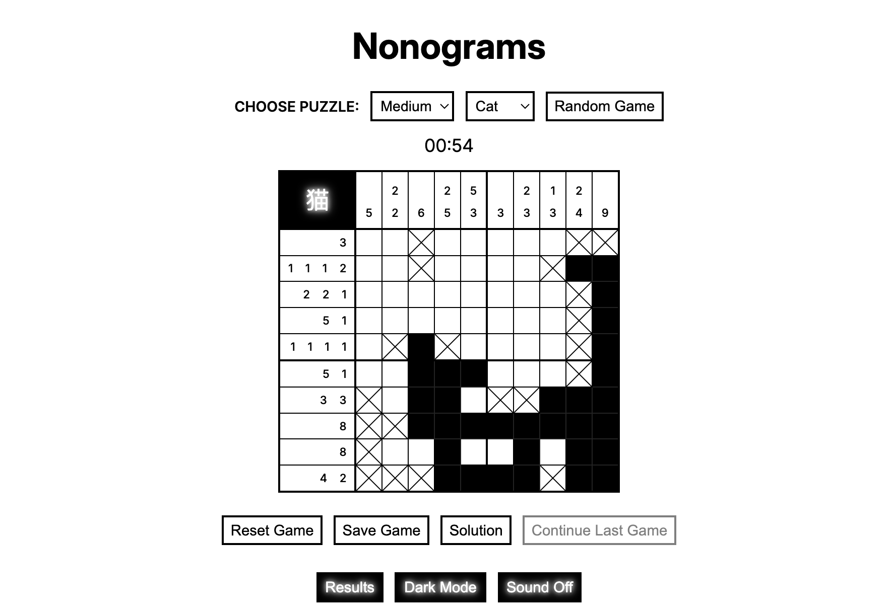

# Nonograms

**Nonograms** is a single-page application implementing a classic puzzle game that challenges users to reveal hidden binary images by logically filling cells according to numeric clues. The app features dynamic creation of all UI elements purely via JavaScript and supports multiple game difficulty levels (easy, medium, hard). The game tracks progress using a stopwatch that starts on the first interaction, detects the end of the game and includes sound effects. Additional features include dark/light themes, random puzzle selection, persistent high score tracking via localStorage, and a solution reveal function.

**Rolling Scopes School Task** — Stage 1: [Nonograms](https://github.com/rolling-scopes-school/tasks/blob/master/tasks/nonograms/README.md)

## Demo



## Local Setup

```bash
git clone https://github.com/asfound/nonograms.git
npm install
npm run dev
```
